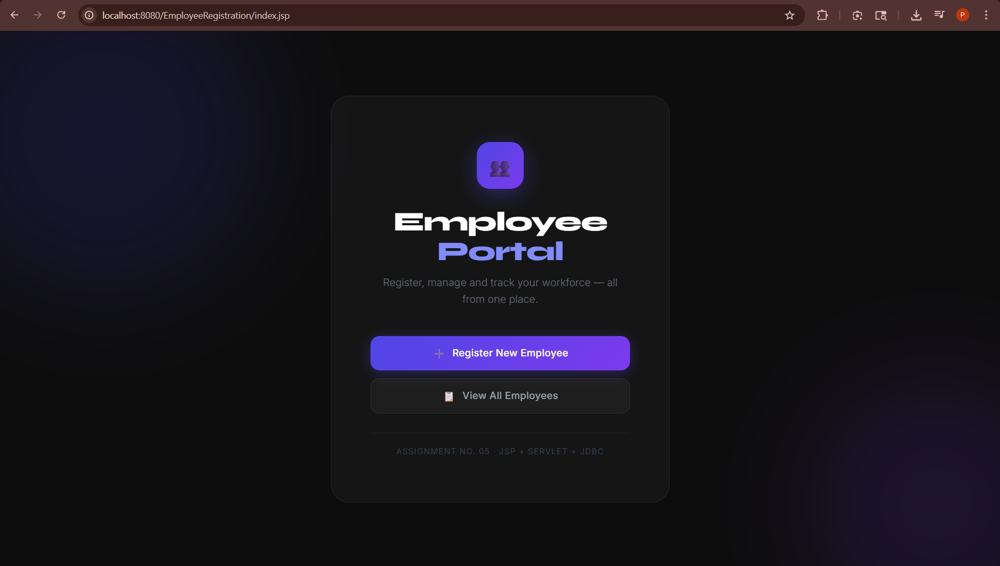
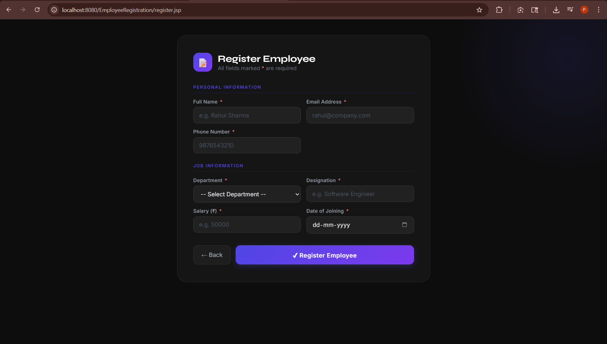
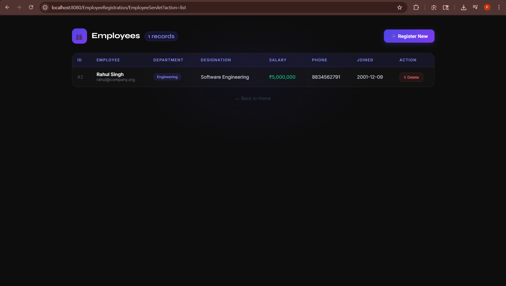

# Assignment No. 05 — Employee Registration Web App
###  Servlet + JSP + JDBC + MySQL

---

## 📌 Aim
Develop a web application for Employee Registration using JSP, Servlet and JDBC.

---

## 🎯 Objectives
- To understand server-side scripting
- To understand the concept of Servlet and JSP
- To learn the working of Servlet and JSP
- To learn the database connectivity using MySQL
- To develop web application using Servlet, JSP and database connectivity

---

## 🛠️ Platform & Technologies Used

| Technology | Version |
|---|---|
| JSP | 2.2+ |
| IDE | Eclipse IDE for Enterprise Java (2023-12) |
| JDK | 25 (Temurin) |
| Apache Tomcat | 8.5.100 |
| Servlet API | 2.5 |
| MySQL Connector | mysql-connector-java-8.0.13.jar |
| MySQL | 8.x |

---

## 📁 Project Structure

```
EmployeeRegistration/
├── src/
│   └── com/emp/
│       ├── DBConnection.java       ← MySQL JDBC connection
│       ├── Employee.java           ← Model / Bean class
│       ├── EmployeeDAO.java        ← Database operations (CRUD)
│       └── EmployeeServlet.java    ← Main Servlet controller
│
├── WebContent/
│   ├── WEB-INF/
│   │   ├── lib/
│   │   │   └── mysql-connector-java-8.0.13.jar
│   │   └── web.xml                 ← Servlet mapping
│   ├── index.jsp                   ← Home / Landing page
│   ├── register.jsp                ← Employee registration form
│   ├── success.jsp                 ← Success confirmation page
│   └── employeeList.jsp            ← View all employees table
│
└── database_setup.sql              ← MySQL database script
```

---

## 🗄️ Database Setup

Run this in MySQL Workbench or MySQL CLI:

```sql
CREATE DATABASE IF NOT EXISTS employeedb;

USE employeedb;

CREATE TABLE IF NOT EXISTS employees (
    id          INT AUTO_INCREMENT PRIMARY KEY,
    name        VARCHAR(100) NOT NULL,
    email       VARCHAR(100) NOT NULL UNIQUE,
    department  VARCHAR(100),
    designation VARCHAR(100),
    salary      DOUBLE,
    phone       VARCHAR(15),
    join_date   DATE
);
```

---

## ▶️ How to Run

### Prerequisites
- JDK 8 or later installed
- Apache Tomcat 8.5 installed
- MySQL Server running
- mysql-connector-java-8.0.13.jar in `WebContent/WEB-INF/lib/`

### Steps

**1. Setup Database**
- Run `database_setup.sql` in MySQL Workbench

**2. Update DB Credentials**
- Open `src/com/emp/DBConnection.java`
- Change `USER` and `PASSWORD` to your MySQL credentials

**3. Compile Java files**
```bash
javac -cp "tomcat/lib/servlet-api.jar;WebContent/WEB-INF/lib/mysql-connector-java-8.0.13.jar" \
      -d "WebContent/WEB-INF/classes" \
      src/com/emp/*.java
```

**4. Start Tomcat**
```bash
startup.bat   # Windows
```

**5. Open Browser**
```
http://localhost:8080/EmployeeRegistration/index.jsp
```

---

## 🌐 Application Flow

```
index.jsp
    │
    ├── [Register New Employee] ──→ register.jsp
    │                                    │ POST
    │                             EmployeeServlet
    │                                    │
    │                          EmployeeDAO.addEmployee()
    │                           (JDBC INSERT → MySQL)
    │                                    │
    │                             success.jsp ✅
    │
    └── [View All Employees] ──→ EmployeeServlet?action=list
                                         │
                               EmployeeDAO.getAllEmployees()
                                (JDBC SELECT → MySQL)
                                         │
                                 employeeList.jsp 📋
```

---

## 📸 Screenshots

### Home Page


### Registration Form


### Employee List


---

### 1. Servlet
A Servlet is a Java class that handles HTTP requests and responses on the server side. It extends `HttpServlet` and overrides `doGet()` and `doPost()` methods to process client requests.

### 2. JSP (JavaServer Pages)
JSP is a server-side technology that allows embedding Java code inside HTML pages using scriptlets `<% %>`, expressions `<%= %>`, and directives `<%@ %>`. It gets compiled into a Servlet at runtime.

### 3. JDBC (Java Database Connectivity)
JDBC is a Java API that enables Java programs to interact with databases. It uses:
- `DriverManager` — to establish connection
- `Connection` — represents DB connection
- `PreparedStatement` — to execute parameterized SQL queries
- `ResultSet` — to retrieve query results

---

Successfully studied and implemented Servlets, JSP and database connectivity using JDBC with MySQL to build a complete Employee Registration Web Application.

---

*Assignment No. 05 | Mobile & Platform Based Java (MPJ)*
